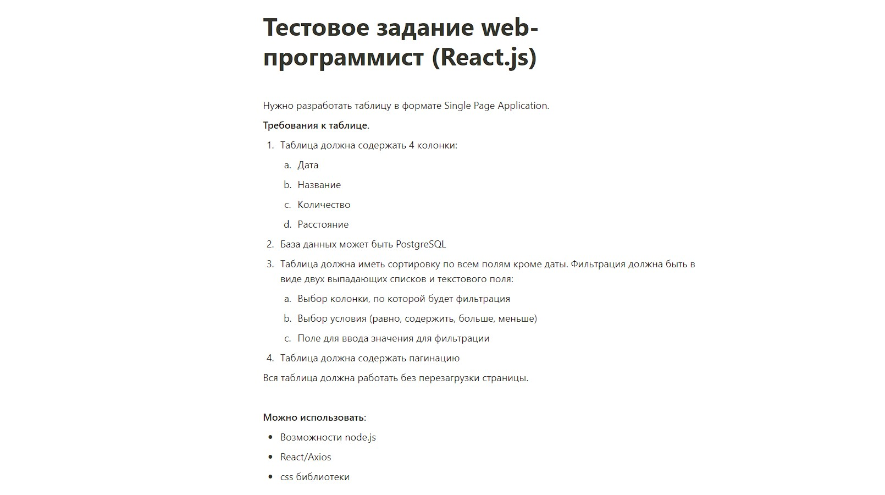
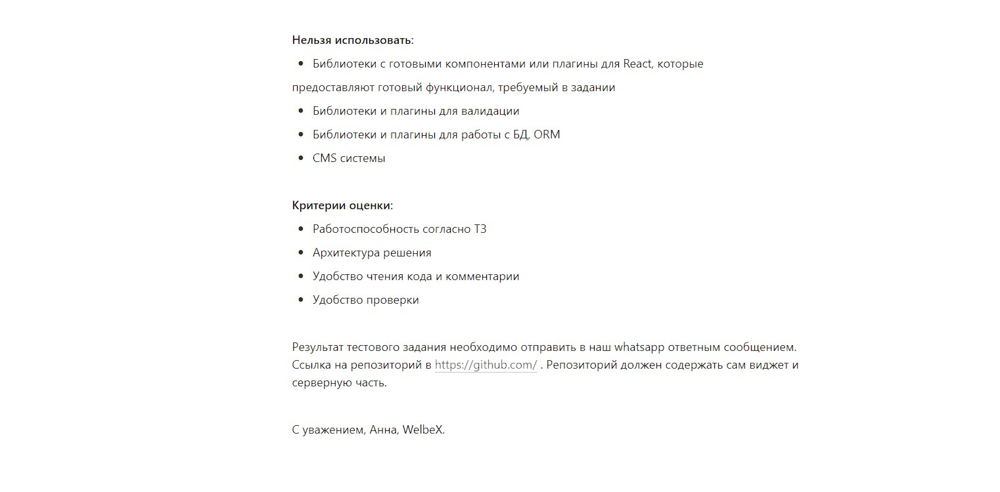

# Тестовое задание на ReactJS для компании WelbeX

## Клонируем репо

## Открываем папку в директории /project и пишем

```
npm install
```

### Открываем пак в режиме разработки

```
npm start
```

#### Моя версия ноды v16.15.1

[> Ссылка на деплой <](https://vagoalex.github.io/WelbeX-React-test-task/)

[> Ссылка на тестовое <](https://faint-adasaurus-4bc.notion.site/web-React-js-22257203622947f8879c527bf8ed0f48)

### Коротко о задании:




#### _Макета не было, дизайн был придуман полностью мной_
